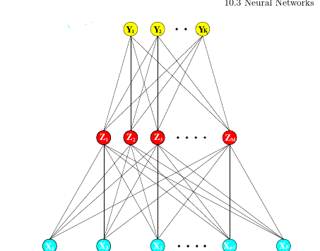

# Planning

## Ideas

 Y. Xu, Q. Zhang, J. Zhang, and D. Tao, “Vitae: Vision transformer
advanced by exploring intrinsic inductive bias,” NeurIPS, vol. 34, 2021.

asdasdasdasdzxcvzxasdf
asdasdasdasdasdasdasdasd

## Datasets:
Understanding the Amazon from Space [20] — multilabel dataset to track the human footprint in the Amazon rainforest; we’ll mostly refer to this as the Amazon dataset.
WiDS Datathon 2019 [21] — binary dataset for oil palm plantation detection in Borneo; we’ll mostly refer to this as the oil palm dataset.
Towards Detecting Deforestation [22] — binary dataset for detecting coffee plantations in the Amazon rainforest; we’ll mostly refer to this as the coffee dataset.

- argumentar necessidade do modelo para imagens de alta resolução (> 250m) e RGB.

- centro de sensoriamento remoto inpe ufmg

- Uma direção possível é detectar somente balsas garimpeiras do rio madeira pelas imagens de alta resolução do CBERS-4A, segundo relatorio do mapbiomas

Mining drives extensive deforestation in the
Brazilian Amazon

Mining poses significant and potentially underestimated risks to tropical forests worldwide. In
Brazil’s Amazon, mining drives deforestation far beyond operational lease boundaries, yet the
full extent of these impacts is unknown and thus neglected in environmental licensing.
Here we quantify mining-induced deforestation and investigate the aspects of mining
operations, which most likely contribute. We find mining significantly increased Amazon
forest loss up to 70 km beyond mining lease boundaries, causing 11,670 km2 of deforestation
between 2005 and 2015. This extent represents 9% of all Amazon forest loss during this
time and 12 times more deforestation than occurred within mining leases alone. Pathways
leading to such impacts include mining infrastructure establishment, urban expansion
to support a growing workforce, and development of mineral commodity supply chains.
Mining-induced deforestation is not unique to Brazil; to mitigate adverse impacts ofk
mining and conserve tropical forests globally, environmental assessments and licensing must
considered both on- and off-lease sources of deforestation.

The Brazilian Amazon deforestation rate in 2020
is the greatest of the decade

http://terrabrasilis.dpi.inpe.br/app/map/deforestation?hl=pt-br

What Do ViTs See

Google’s Vision Transformers (ViT) can be likened to Transformers when it comes to the way its architecture processes natural language and to CNNs when it comes to vision tasks. In ViTs, images are represented as sequences, and class labels for the image are predicted, which allows models to learn image structure independently. Input images are treated as a sequence of patches where every patch is flattened into a single vector by concatenating the channels of all pixels in a patch and then linearly projecting it to the desired input dimension. Google even claimed that their ViT outperforms state-of-the-art CNN with four times fewer computational resources when trained on sufficient data.
https://analyticsindiamag.com/are-visual-transformers-better-than-convolutional-neural-networks/
https://analyticsindiamag.com/openai-language-models-vision-gpt-neural-networks/
https://towardsdatascience.com/detecting-deforestation-from-satellite-images-7aa6dfbd9f61?gi=31a843652acf
https://github.com/google-research/vision_transformer

Artificial Intelligence

Deforestation invariably leads to many plants and animals losing their natural habitat, resulting in ecological imbalance and threat to the environment.

Problem statement

Create a solution to improve existing environment models or figure out new ways to anticipate deforestation rate of forests using images to see how the government is meeting their commitment to the environment.

Tech Stack

1. Artificial intelligence

Task

1. Track whether environment-related goals are being met
2. What is the progress in achieving the goals
3. Image analysis on Satellite data
4. Predict the rate of deforestation

Submission format

1. Source code in a zip folder
2. Related documents and PDFs
3. Used dataset
4. PPT for idea submission and final presentation

ihttps://github.com/DS3Lab/forest-prediction
https://sites.psu.edu/2050destruction/2018/04/12/deforestation/

https://becominghuman.ai/can-we-predict-deforestation-in-amazon-forests-with-machine-learning-2dc7785e5e49

Star methodology

Aqui, deixa eu te explorar um pouco?
Rem como revisar o texto do meu pre-tcc?
kkkkkkkkkkkkkkk

Eu atrasei muuuito mesmo e me deram uma ultima chance pra entregar amanhã, mas tenho só essa chance mesmo. O orientador não vai conseguir revisar a tempo.

E não precisa revisar se estiver sem tempo, pq pedi pra algumas pessoas em paralelo, é só se for possível meeesmo!
Brigadão :D

É só deixar destacado ou comentar no pdf o que não achou inteligível ou não deu pra entender. Ele é pra ser compreendido mesmo por quem não é da área.

# Thesis
0 - read papers
1 - first version: sketch
2 - second version: grinding/prunning
3 - third party text review
4 - review correction
5 - Tutor review
x - Done

1. [40%] Pre textuals
   1. Cape
   2. Abstract Pt+ en
   3. Tables of symbols, abreviations
2. [80%] Introduction
3. [60%] Revision
4. [60%] Methodology
5. [0%] Experiments
6. [0%] Results
7. [0%] Conclusion

## Introduction
 - [x] Text
   - [x] Contextualization
   - [x] Problem introduction
   - [x] Objective
 - [x] Illustrations
 - [ ] Review to remove specialists def
## Theoretical revision + Literature review

- [ ] Intro to chapter
- [ ] Problem domain
  - [ ] Localization
  - [ ] Remote sensing
  - [ ] Intersection ML
- [ ] Theoretical revision & definitions
  - [ ] Machine Learning:
    - [ ] Definition
    - [ ] regression
      - Given input samples and outputs, estimate function f, predict x
    - [ ] classification
      - Given input samples and Labels, estimate function f, predict x
      - Given input samples, estimate function f, predict x
    - [ ] prediction
    - [ ] Metrics
      - [ ] NMAE
      - [ ] RSME
      - [ ] NEgLOG
      - [ ] EuclidDis
    - [ ] training supervised
    - [ ] Unupervised
    - [ ] Semi supervised
    - [ ] PreProcess
    - [ ] Feature extractor
    - [ ] Regularization
    - [ ] overfit,
    - [ ] underfit
    - [ ] generalization
    - Model selection
  - [ ] ANN:
    - perceptron,
  - [ ] Deep Learning
  - [ ] CNN:
    - Convolutional
    - Pooling
    - Fully connected
    - sigmoid
  - [ ] Transfer Learning/ pre trainning
  - [ ] Feature extractor
  - [ ] AVL RVL template matching
  - [ ] Resnet SOTA models
  - [ ] Transformers
- [90%] Literature SOTA review about the problem
  - [ ] Previous papers
    - [ ] Paper 1 semantic segmentation + template matching
    - [ ] Paper 2 CNN + Regression
    - [ ] Paper 3: pre-trained CNN
  - [ ] Tools: pytorch

# Methodology
1. [70%] Datasets
   1. [ ] Add Images
   2. [ ] Origin of datasets
   3. [ ] Table summaring them
2. Premisses
3. Proposed solutions
   1. [ ] Images of architecture
4. Environment and tools
5. Experiments
  - [ ] Steps
  - [ ] Resume
  - [ ] Baseline
  - [ ] Pipeline

## 1. Datasets
- Million A1
- Understanding the Amazon from Space [20] — multilabel dataset to track the human footprint in the Amazon rainforest; we’ll mostly refer to this as the Amazon dataset.
WiDS Datathon 2019 [21] — binary dataset for oil palm plantation detection in Borneo; we’ll mostly refer to this as the oil palm dataset.
Towards Detecting Deforestation [22] — binary dataset for detecting coffee plantations in the Amazon rainforest; we’ll mostly refer to this as the coffee dataset.

## 2. Premisses
As premisses, already mentioned on literature review, we have:
- limited hardware
- variability images caused by:
  - sensor
  - weather
  - rotation
  - light
  - angle of camera
  - changinges on soil
- Limited dataset of region of interest with lack of covering on all variations
## 3. Proposed solutions
To overcome limitation on hardware and enough dataset to generalize over all possible variations, we propose the following solution:
- Our solution
  - pre-trained model on dataset milllion + last layers trained with our geo spatial dataset
  - applying regularization and model compression, evaluate application to embedeed systems
  - Experimenting to find the best model, best regularization and tunning

## 4. Environment and tools
We will use pytorch since it has a broad adoption on market and academy and with it large ammount of tools and resources already developed applied to computer vision. It will be developed on a jupyter notebook for each experiment and replicable.
## 5. Experiments

- Experiments in increasing complexity
- First replicate work in the paper 2 to guarantee correctness (hardtask since it is 80gb dataset)
  - simplify with just one map (it doesn't generalizes enough)
  - try to ask repo to replicate, if not, replicate by myself ( kinda hard)
- Replicate method of paper 2 within paper 1 (optional)
- Get method of paper 3, with pre-trained CNN train to speciefic map using method of paper 2 on dataset of 1
- First test with geo images, then validate with drone images
- include illustrations of all experiments
- Investigate multi modal distribuition

In resume:
  1. Replicate experiments from papers (Doc only if needed)
  2. Replicate experiment 0 with our dataset (Doc only if needed)
  3. Replicate experiment 0 with our dataset & pre-trained net (Doc only if needed)
  4. Training with minimal fine-tunning and validate of 3 with split cross validation on  geo datasets
  5. Same as 4, but dataset including data augmentation with rotation (wont do)
  6. Evaluate performance of 3 with our drone dataset
  7. Evaluate performance of 3 with our drone dataset on nvidia jetson (only if needed)

## Experiment 0 (Experiments from papers):
 - Replicate experiment from paper 2
 - Replicate experiment from paper 3 (optional)
## Experiment 4 (Experiment from paper 2 with our dataset + pre-trained + model):
- Pre process:
  - Get 2000 random crops and latitude & longitude as labels scaled to 0-1 minmax scaler
  - Offline down sampling by cubic interpolation, Online by bi linear interpolation
  - Down sample to the input of the model
  - Maybe saved to jpegs to reduce file size -> questionable decision ( artifacts consistent in training & testing)
  - test Xception and nets from paper 3
- Training:
  - Geolocation images
  - minimal finetune
  - performance as mean absolute error
  - 500 epochs
  - use pre-trained net with additional fully connected layers with dropout/prunning for regularization and capacity
  - distribuition output, likelyhood loss based log function
- Validation
  - Test replicability (How?)
  - Performance metrics for regression
  - Table comparing performance with paper 1 and related results

- Original Paper 2 methodology:
  - for each dataset 2000 random 3x3 km crops taken from ROI
  - Downsampled to 1000x1000px
  - croped again to random 1.5x1.5km 224px
  - latitude and longitude as label of image center scaled to 0-1 min max scaler
  - flat world assumption
  - offline downsampling done by cubic interpolation
  - online down done by bi linear interpolation
  - crops saved as jpegs to reduce file size -> questionable decision
  - sampling and jpeg can introduce artifacs but are consistent in traning and testing
  - origin paper test many nets
  - use only one dataset to compare models
  - minimal fine tune
  - performance as mean absolute error
  - 500 epochs
  - selected xception with aditional fully connected layers with dropout for aditional regularization and capacity
  - distribuition output, likelyhood based log function
  - to product std output
  - image ilustrating method
  - table comparing performance
  - compare field view
  - comparing loss function: msqe, euclidean dist, RMSE
  - test replicability
  - past paper had encouraging results with limited tuning
  - relative large error on sample input but small on ROI: 100m over 33x33km2
  - also added a measure of uncertainty as output std
  - likelyhood loss model might improved training time
  - it create variability from cropping
  - Future work may wish to investigate choice of output
  distribution further. Multi-modal distributions, as in mixture density networks, may be able to better encapsulate uncertainty caused by distant locations being visually similar.

## Discution:
CNN may be ill suited for regression/location (coordconv)
For classification on remote sensing just cnn isnt enought, due high variability intraset, and similarity outter set. Needs contextual information, then transformers may fit.

## Future works:
- Use gan for data augmentation for variability of camera, climate, night, height, rotation
- CNN may be ill suited for regression/location (coordconv)
- Newer datasets will provide better models. Data driven vs quality driven models

# Apresentação Final (video pitch)

Vídeo no formato "pitch" (i.e., onde você tenta "vender seu peixe"), com duração de 3 a 5 minutos, onde você aborda os seguintes aspectos do seu trabalho:

##    A proposta do trabalho (What)
A proposta deste trabalho é usar visão computacional e criar um modelo de localização visual, similar como pilotos se localizam.
##    A motivação para o trabalho (Why)
Localização visual é um potencial backup para sistemas de navegação de drones ou aeronaves em espaços onde não há a disponibilidade de GPS, seja por interferência de ilhas urbanas, sinais refletidos, por indisponibilidade de satélites, ou mesmo por guerra eletrônica, em que pode haver negação de sinal por jamming ou mesmo spoofing, que é um sinal falsificado.
##    O método usado (How)
Este trabalho propôe uma solução por deep learning, utilizando uma rede neural pré treinada e treinada com imagens geoespaciais localizadas da região de interesse. Ela realiza uma regressão das coordenadas dada a imagem de entrada.
##    Resultados e discussão
Nos resultados será avaliado o desempenho e comparado com outros modelos encontrados na literatura.
##     Conclusão
Este trabalho colocará em prática conhecimentos de aprendizado de máquina, redes neurais e reconhecimentos de padrões.

Pontos importantes:

Notem que fazer uma boa apresentação onde todos os tópicos acima são cobertos de forma clara num intervalo de tempo tão curto (até 5 minutos) é um desafio que requer um bom planejamento. Portanto, não se trata de simplesmente entrar na frente do celular e falar, por até 5 minutos, a primeira coisa que lhe vem à cabeça a respeito do que foi feito ao longo do semestre.
A ideia é que você faça um vídeo onde você aparece fazendo a apresentação dos slides como se você estivesse apresentando para uma plateia. No entanto, caso você não queira fazer deste modo, você pode usar algum software de captura de tela (e.g., https://obsproject.com/) para gravar um vídeo da apresentação dos slides na tela do computador, com a sua narração. No entanto, neste caso, você deve aparecer pelo menos no começo do vídeo apresentando o slide de título, para efeito de confirmação de sua identidade.
Faça o upload do arquivo de vídeo para algum serviço de hospedagem de vídeos (e.g., Youtube), coloque o link do vídeo num arquivo texto e faça a entrega apenas do arquivo texto. Caso você não queira que o vídeo fique disponível a todos na Internet, ao fazer o upload do arquivo de vídeo você pode fazê-lo no modo unlisted (não listado), de forma que apenas as pessoas com acesso ao link conseguirão visualizar o vídeo.

rev bib

01 forest vit
Abstract— Understanding the dynamics of deforestation and
land uses of neighboring areas is of vital importance for the
design and development of appropriate forest conservation and
management policies. In this article, we approach deforestation
as a multilabel classification (MLC) problem in an endeavor
to capture the various relevant land uses from satellite images.
To this end, we propose a multilabel vision transformer model,
ForestViT, which leverages the benefits of the self-attention
mechanism, obviating any convolution operations involved in
commonly used deep learning models utilized for deforestation
detection. Experimental evaluation in open satellite imagery
datasets yields promising results in the case of MLC, partic-
ularly for imbalanced classes, and indicates ForestViT’s supe-
riority compared with well-established convolutional structures
(ResNET, VGG, DenseNet, and ModileNet neural networks). This
superiority is more evident for minority classes.
Index Terms— Deforestation, multilabel image classification,
self-attention, vision transformers.

__________

Draft

Segundo o MapBiomas (https://plataforma.brasil.mapbiomas.org/):
-
A área de garimpos terrestres na bacia do rio Madeira saltaram de 3753 ha em 2007 para 9660 ha em 2020, uma expansão de 5907 hectares (que equivale a mais 8200 campos de futebol).
- A área de garimpos detectados para o ano de 2020 é o recorde da série de dados, que conta com 36 anos de imagens de satélite.

- A Amazônia concentra 94\% (mais de 100 mil hectares) da área garimpada brasileira, sendo mais de 50\% potencialmente ilegais, por ocorrerem dentro em Terra Indígenas e Unidades de Conservação. A área de garimpo no bioma cresceu 10x nas últimas três décadas, com 301\% de expansão em UCs e 495\% em TIs.

O Brasil pertence a um seleto grupo de países capazes de
desenvolver, operar e utilizar satélites e seus dados. Nessa área o
país pode se orgulhar da posição que ocupa. Somos um dos países
que melhor monitora seu território, em diferentes recortes do
tempo e do espaço, atendendo a diferentes necessidades da
sociedade civil, da academia ou do mercado financeiro.
Para tal, usamos satélites nacionais, como o CBERS-4A e o
AMAZÔNIA-1 (ambos desenvolvidos pelo INPE), e internacionais,
sejam públicos (casos do Landsat, da NASA, e do Sentinel, da ESA)
ou privados (como os nanossatélites da empresa Planet), isso para
manter curta a lista de exemplos. Somos capazes, portanto, de
observar e monitorar balsas garimpeiras ao longo de um rio.

O garimpo ilegal na Amazônia deve ser monitorado, combatido e eliminado.
-
O uso de imagens de satélite de alta resolução espacial (como a do CBERS-4A desenvolvido pelo
INPE) pode ser utilizado para monitorar a dinâmica de balsas garimpeiras na Amazônia e
auxiliar na fiscalização, combate e controle dos ilícitos ambientais.
-
Combinações de múltiplos satélites, de média e alta resolução, do espectro óptico e radar,
devem ser exploradas para aumentar a frequência de observação e a capacidade de
monitoramento de balsas garimpeiras, mesmo em condições de intensa nebulosidade.
-
Outras inovações tecnológicas, como classificadores de aprendizado profundo (Deep Learning),
devem ser exploradas para facilitar e automatizar a detecção das balsas garimpeiras e de seus
impactos associados.

3. Método
Fusão de dados óticos e interpretação visual
Foi utilizado uma imagem única de 25 de Outubro de 2021, do satélite CBERS-4A, do sensor WPM, com 2 metros
de resolução após fusão das bandas pan + RGB, para identificar visualmente as balsas garimpeiras no rio Madeira,
no trecho ao norte de Borba, no Amazonas.
O CBERS-4A é um satélite nacional, desenvolvido pelo INPE, gratuito e com imagens de todo o território brasileiro
disponíveis na internet. Trata-se do satélite público de maior resolução espacial do planeta.

---

The projected economic mitigation potential of AFOLU options between 2020 and 2050, at
costs below USD100 tCO2-eq-1, is 8-14 GtCO2-eq yr-1 [FOOTNOTE 61] (high confidence). 30-50\% of
this potential is available at less than USD20/tCO2-eq and could be upscaled in the near term across
most regions (high confidence). The largest share of this economic potential [4.2-7.4 GtCO2-eq yr-1]
comes from the conservation, improved management, and restoration of forests and other ecosystems
(coastal wetlands, peatlands, savannas and grasslands), with reduced deforestation in tropical regions
having the highest total mitigation. IPCC 2022

IPCC, 2022: Summary for Policymakers [H.-O. Pörtner, D.C. Roberts, E.S. Poloczanska, K. Mintenbeck, M. Tignor, A. Alegría, M. Craig, S. Langsdorf, S. Löschke, V. Möller, A. Okem (eds.)]. In: Climate Change 2022: Impacts, Adaptation, and Vulnerability. Contribution of Working Group II to the Sixth Assessment Report of the Intergovernmental Panel on Climate Change [H.-O. Pörtner, D.C. Roberts, M. Tignor, E.S. Poloczanska, K. Mintenbeck, A. Alegría, M. Craig, S. Langsdorf, S. Löschke, V. Möller, A. Okem, B. Rama (eds.)]. Cambridge University Press. In Press.

- contextualização do desmatamento da amazônia e pantanal
- amazonia chegando perto do ponto de inflexão  https://www.nature.com/articles/d41586-020-00508-4
- ciclo do carbono e armazenamento
evidencias que esse dano já está acontecendo

- causado por fatores antropicos
- desmatamento pra area de gado, pra mateiras raras, mineração e garimpo
- invasão de terras indigenas por disputas territoriais
- estatisticas de taxas
- estatistica do tanto que foi devastado
- importancia do monitoramento para politicas publicas
- centro de sensoriamento remoto ufmg, site de monitoramento amazonia
- inpe e ibama
- como são monitorados: satelites, definição de sensoriamento remoto
- como é possivel automatizar detecção desses eventos por meio de visão computacional
- modelos como cnn, resnet possibilitaram grande avanço
- atualmente a classe de transformers visuais tem tomado espaço por tomarem informações contextuais, além precisar de menos amostras de treino
- contudo aplicado a sensoriamento remoto pode ser dificultado por escassez de amostras rotuladas,
- além de variabilidades de imagem devido a diferentes sensores

- esse trabalho tem como objetivo estudar a aplicação de transformers visuais pré treinados com imagens de satélite são apropriados para
- aplicaçoes de detecção de eventos na amazonia
- reduzir pode ser a melhor medida de mitigação contra aquecimento global, citar IPCC2022

A Floresta amazônica enfrenta uma degradação antrôpica sem precedentes. Desde a década de 70, encolheu 15\% e da porção brasileira, que corresponde a metade, encolheu em 19\%. O desmatamento em 2020 atingiu o pico da década, correspondendo 10.000km², um aumento de 30\% em relação ao ano anterior. Dentre os principais fatores se encontram o desmatamento para pasto de pecuária, para cultivo de soja, incêndios e garimpo.

Diante dessa degradação do bioma, é previsto um ponto de inflexão onde a floresta deixa de ser auto sustentável, em aspectos climáticos, como a necessária alta evapo-traspiração da vegetação para manter a precipitação e monçoes. A partir de tal ponto de inflexão, o bioma enfrentará transições irreversiveis para a um clima mais árido como de cerrado/savana, trazendo consigo incêndios e secas. A transição do bioma é tida como uma realimentação positiva, onde são amplificadas as condições de degradação do bioma amazônico, acelerando mais ainda sua degradação.

A importância do bioma para o clima global é imprescindível, sendo responsável por captura de gás carboônico.

The deterioration of the natural world is unparalleled in human history and a key driver of the climate crisis. Since 2000, we have lost 361 million ha of forest cover (roughly the size of Europe) accounting for about a quarter of global anthropogenic emissions[1] (and this may be an underestimate[2]), largely driven by deforestation and forest degradation. Deforestation does not only release carbon (e.g., through slash-and-burn), but also destroys a multitude of other forest ecosystem services: preserving biodiversity, counteracting flooding and soil erosion, filtering water, and offering a livelihood for the local population. Major conservation and restoration efforts are underway to mitigate and safeguard against these losses, and to highlight the urgency of the issue, 2021-2030 has been declared the “UN Decade on Ecosystem Restoration”. However, we cannot preserve what we cannot measure. There is an urgent need to understand the location, health and ecological value of nature and biodiversity, and ensure these metrics are reflected in policy, finance, and decision-making. Machine learning (ML) can play a significant role in responding to this critical call for action and can accelerate the conservation and sustainable use of forestry and other land use.

% No que tange a sistemas de visão computacional, é relevante mencionar o progresso nos últimos anos providos por técnicas de aprendizado de máquina que envolvem redes neurais profundas e redes neurais convolucionais (\textit{CNNs}). Além de atingiram o estado da arte em numerosas tarefas~\cite{ABIODUN2018e00938}, já são amplamente aplicadas com sucesso nos campos da robótica e de visão computacional. Contudo ainda limitadas em aplicações de VANTs, devido a ausência de modelos robustos e portáveis para sistemas embarcados, dado suas restritivas limitações de recursos computacionais. Outro ponto relevante de mencionar é a necessidade de uma elevada quantidade de amostras de imagens aéreas de treino em uma mesma região, que podem dificultar a elaboração de um modelo de boa acurácia.

% Dado todos esses fatores, este trabalho estudará alternativas de localização visual utilizando modelos de redes neurais sob todas as limitações citadas. Contemplará as limitações de quantidade reduzida de amostras de treino para os modelos e limitações de \textit{hardware} em sistemas embarcados. Assim como propor uma implementação factível. Consiste em mais quatro capítulos, respectivamente: revisão bibliográfica, metodologia para a implementação de solução, análise de resultados e a conclusão, incluindo contribuições e direções futuras para este problema estudado.

Every minute, the world loses an area of forest the size of 48 football fields. And deforestation in the Amazon Basin accounts for the largest share, contributing to reduced biodiversity, habitat loss, climate change, and other devastating effects. But better data about the location of deforestation and human encroachment on forests can help governments and local stakeholders respond more quickly and effectively.

Planet, designer and builder of the world’s largest constellation of Earth-imaging satellites, will soon be collecting daily imagery of the entire land surface of the earth at 3-5 meter resolution. While considerable research has been devoted to tracking changes in forests, it typically depends on coarse-resolution imagery from Landsat (30 meter pixels) or MODIS (250 meter pixels). This limits its effectiveness in areas where small-scale deforestation or forest degradation dominate.

Furthermore, these existing methods generally cannot differentiate between human causes of forest loss and natural causes. Higher resolution imagery has already been shown to be exceptionally good at this, but robust methods have not yet been developed for Planet imagery.

In this competition, Planet and its Brazilian partner SCCON are challenging Kagglers to label satellite image chips with atmospheric conditions and various classes of land cover/land use. Resulting algorithms will help the global community better understand where, how, and why deforestation happens all over the world - and ultimately how to respond.

To dig into/explore more Planet data, sign up for a free account.

And if you're interested in building applications on Planet data, check out our Application Developer Program.
Getting Started

    Review the data page, which includes detailed information about the labels and the labeling process.
    Download a subsample of the data to get familiar with how it looks.
    Explore the subsample on Kernels. We’ve created a notebook for you to get started.

Every minute, the world loses an area of forest the size of 48 football fields. And deforestation in the Amazon Basin accounts for the largest share, contributing to reduced biodiversity, habitat loss, climate change, and other devastating effects. But better data about the location of deforestation and human encroachment on forests can help governments and local stakeholders respond more quickly and effectively.

Planet, designer and builder of the world’s largest constellation of Earth-imaging satellites, will soon be collecting daily imagery of the entire land surface of the earth at 3-5 meter resolution. While considerable research has been devoted to tracking changes in forests, it typically depends on coarse-resolution imagery from Landsat (30 meter pixels) or MODIS (250 meter pixels). This limits its effectiveness in areas where small-scale deforestation or forest degradation dominate.

Furthermore, these existing methods generally cannot differentiate between human causes of forest loss and natural causes. Higher resolution imagery has already been shown to be exceptionally good at this, but robust methods have not yet been developed for Planet imagery.

In this competition, Planet and its Brazilian partner SCCON are challenging Kagglers to label satellite image chips with atmospheric conditions and various classes of land cover/land use. Resulting algorithms will help the global community better understand where, how, and why deforestation happens all over the world - and ultimately how to respond.

To dig into/explore more Planet data, sign up for a free account.

And if you're interested in building applications on Planet data, check out our Application Developer Program.
Getting Started

    Review the data page, which includes detailed information about the labels and the labeling process.
    Download a subsample of the data to get familiar with how it looks.
    Explore the subsample on Kernels. We’ve created a notebook for you to get started.